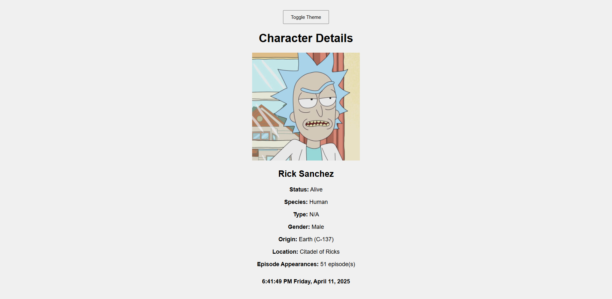

# Rick and Morty Character Encyclopedia

This is a web-based character encyclopedia built using the [Rick and Morty API](https://rickandmortyapi.com/). It displays a gallery of characters with pagination and provides detailed views for each character in a separate page. A live-updating footer clock is included on all pages.




---

## 🚀 Features

- Character gallery in a 3×2 responsive grid
- Pagination with "Next" and "Previous" buttons
- Detailed character view in a new tab
- Live-updating clock on every page
- Dark/Light theme toggle
- "Random Character" button

---

## 🔧 Setup Instructions

1. **Clone the repository**
   ```bash
   git clone https://github.com/heyabhinav/rick-and-morty-encyclopedia.git
   cd rick-and-morty-encyclopedia
